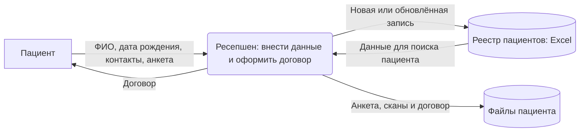
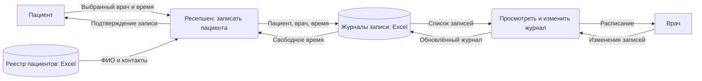
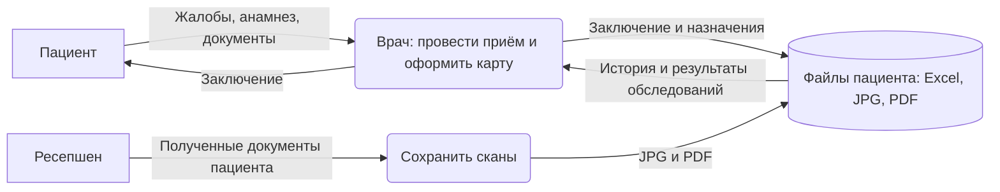
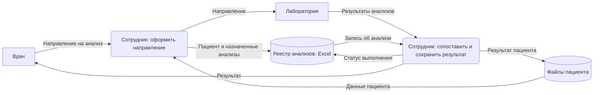
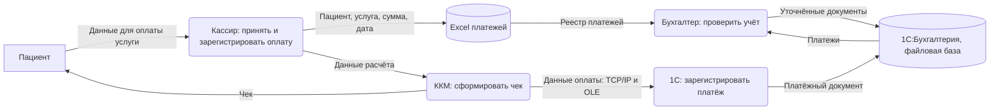
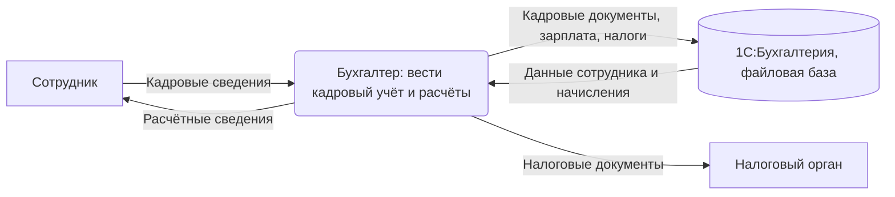
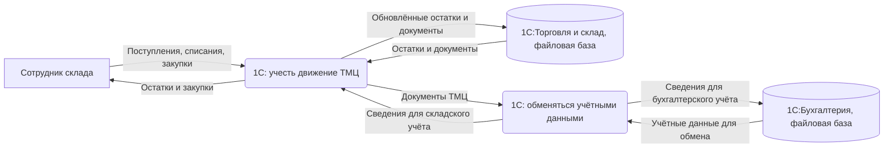

# Текущие потоки данных (As-Is)

Прямоугольник — участник или внешняя система, скруглённый блок — операция, цилиндр — хранилище. Стрелки подписаны передаваемыми данными. Использованы основные элементы [DFD](https://lucid.co/diagram/dfd/tutorial) с упрощённым обозначением хранилища.

Во всех схемах Excel и папки находятся на общем диске. Доступ ограничен только доменной аутентификацией, действия с данными не протоколируются.

## 1. Регистрация пациента и договор

Адрес, место работы или учёбы и хронические заболевания могут попасть в расширенную анкету. Хранение договора рядом с файлами пациента принято как допущение: точная папка в условии не указана.

## 2. Запись на приём

## 3. Ведение медицинской карты

На схеме показаны чтение истории пациента и сохранение результатов приёма в медицинскую карту.

## 4. Учёт анализов

В условии есть реестр анализов и лаборатория, но не описаны канал обмена и ответственный сотрудник. Ручная отправка направления и загрузка результата показаны как допущение. Действующего API в As-Is нет.

## 5. Приём и учёт оплаты

Показаны сведения об оплате; хранение полных реквизитов банковской карты в условии не заявлено. Сверка бухгалтером двух источников — допущение.

## 6. Кадровый учёт, зарплата и налоги

Кадровые и налоговые операции указаны в кейсе. Состав входных документов и канал отправки отчётности не описаны.

## 7. Склад и закупки

Интеграция двух 1С указана в задании; протокол и состав полей не описаны. Наличие контактов физических лиц у поставщиков нужно проверить при инвентаризации.
