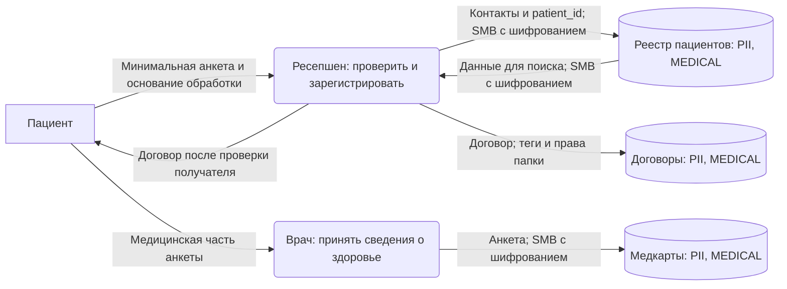
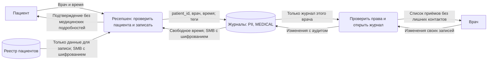
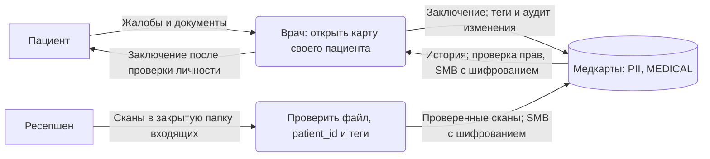
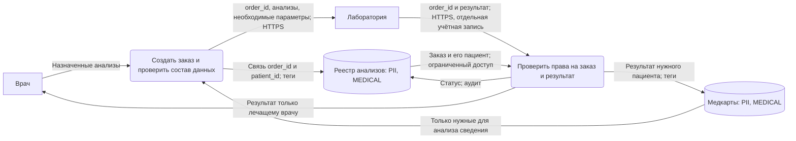
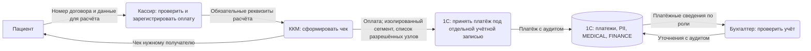
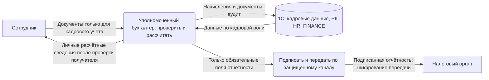
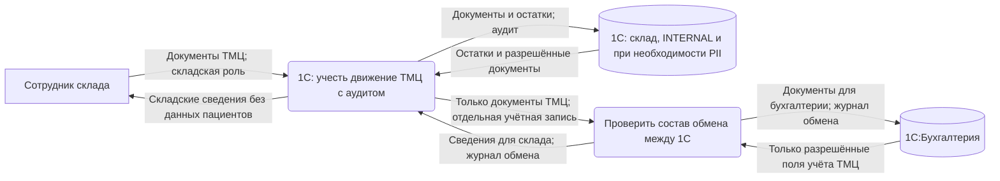

# Потоки с мерами защиты

Обозначения и номера процессов совпадают с [As-Is](as-is.md). Это предлагаемые изменения.

Общие меры для всех схем: именные учётные записи, права по роли, аудит чтения и изменений, шифрование дисков и резервных копий. Файлы передаются по SMB 3 с шифрованием. Теги назначаются FSRM по правилам из [описания решения](README.md#тегирование). Журналы аудита собираются отдельно и доступны только ответственным за безопасность.

## 1. Регистрация пациента и договор

Ресепшену доступны контакты и договоры. Медицинская анкета сохраняется отдельно и доступна врачу. Новые документы до классификации попадают в закрытую папку. В именах папок используется patient_id.

## 2. Запись на приём

Права NTFS на отдельные журналы выдаются ресепшену и соответствующему врачу. Контакты и диагнозы в журнал не копируются; в нём остаются ID пациента, врач и время.

## 3. Ведение медицинской карты

Группы AD и права папки ограничивают доступ лечащими врачами. Ресепшен может передать новый скан через входящую папку, но не читать накопленную медкарту. Для новых систем это же правило нужно проверять при каждом запросе к записи пациента.

## 4. Учёт анализов

Во внешнем заказе используется случайный order_id. Ф. И. О., адрес и контакты не передаются, если не нужны для исследования. Таблица соответствия остаётся в клинике. Лаборатории разрешён доступ только к её заказам; одного знания order_id недостаточно. Передача должна иметь законное основание и согласованный состав данных.

## 5. Приём и учёт оплаты

Дублирование в Excel убирается. Кассир видит необходимые данные расчёта, бухгалтер — данные учёта, медицинские заключения им недоступны. Обязательные реквизиты чека сохраняются. Для ККМ и OLE сетевое ограничение уменьшает риск; возможность шифрования самого соединения нужно проверить у используемых компонентов.

## 6. Кадровый учёт, зарплата и налоги

Кадровая роль назначается отдельно от кассовой. Расчётные документы сотрудников нельзя размещать в общей папке. На схеме выделена часть данных 1С, физически она может находиться в той же базе, что и платежи.

## 7. Склад и закупки

Для обмена задаётся список полей. Медкарты и зарплаты в него не входят. Обмен ограничивается доверенными узлами и отдельной учётной записью; защита канала выбирается после уточнения протокола. Выгрузки получают теги исходных данных; для общих отчётов оставляются суммы и количества без контактов физических лиц.
