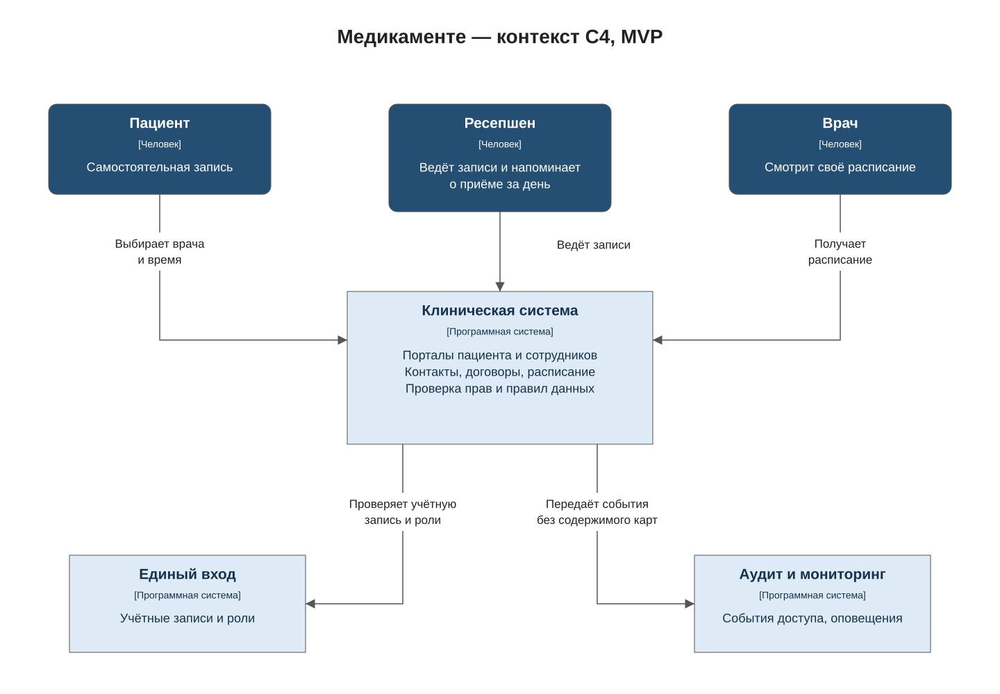
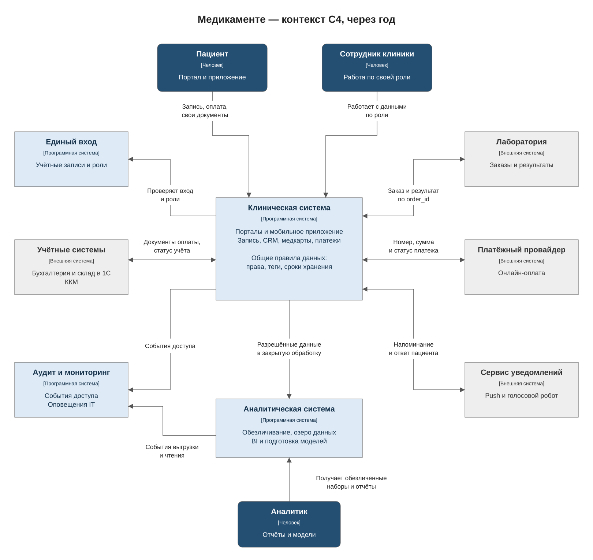

# Задание 2. Проектирование решения

Основные проблемы текущей системы — общий доступ к файлам, ручной ввод и отсутствие аудита. Их разбор приведён в [задании 1](../Task1/problems.md).

Клиническую систему предлагается начать с одного приложения на Java и PostgreSQL. Запись, CRM, медкарты и платежи разделяются на модули. Бухгалтерия и склад остаются в 1С. Это сокращает число сервисов, которые нужно поддерживать небольшой IT-команде.

## MVP через два месяца

Пациент выбирает врача и время через портал. Запись сразу видна ресепшену, а врач видит своё расписание. Система занимает свободный слот в одной транзакции; ограничение в БД исключает двойную запись.

За день до приёма ресепшен получает список записей на завтра, напоминает пациенту и врачу и отмечает результат в системе. Напоминания на этом этапе выполняет сотрудник. Медкарты пока хранятся в защищённых папках по правилам задания 1, расчёты ведутся в 1С.

## Целевое состояние через год

Добавляются мобильное приложение, медкарты, платёжный модуль, лаборатория и аналитика. Пациент получает push или голосовое напоминание и может подтвердить либо отменить приём. Ответ проверяется по владельцу записи, меняет её статус и появляется у ресепшена. При отмене слот освобождается, врач видит обновлённое расписание. Повторный ответ не создаёт новую операцию.

Обе схемы показывают людей и взаимодействующие системы на уровне [контекста C4](https://c4model.com/diagrams/system-context). Редактируемый источник: [context.drawio](context.drawio), страницы «MVP» и «Целевое состояние». Общие правила данных входят в клиническую систему; единый вход, аудит и аналитика выделены отдельно.

## Блоки защиты данных

| Блок | Что делает | Какой риск снижает |
| --- | --- | --- |
| Единый вход | Keycloak с AD для сотрудников. Выдаёт роли, поддерживает отзыв доступа; для сотрудников включена MFA | Использование чужой или уволенной учётной записи |
| Правила обработки данных | Общий модуль проверяет владельца записи, роль, цель обработки и разрешённые поля по тегам. Применяется к записи, CRM, медкартам, оплате, уведомлениям и выгрузкам | Доступ к чужой карте и передача лишних полей |
| Аудит и мониторинг | Хранит пользователя, ID объекта, время, действие и результат. Содержимое документов и токены в журнал не попадают. Массовое чтение и повторные отказы вызывают оповещение IT | Незамеченная утечка и отсутствие истории действий |
| Аналитический слой | Отдельно обрабатывает и хранит проверенные обезличенные наборы | Раскрытие пациентов через отчёты и модели |

По умолчанию доступ запрещён. Роль разрешает действие, а принадлежность записи и назначение врача проверяются при каждом запросе. При недоступности проверки операция блокируется. Аналитика использует тот же реестр правил и отправляет события в аудит; в 1С сохраняются собственные роли.

## Домены и доступ

В PostgreSQL домены разделяются по схемам и правам служебных учётных записей. Связь между ними идёт через patient_id. Пользователи работают через приложение.

| Домен | Данные и теги | Кому разрешён доступ |
| --- | --- | --- |
| Пациенты и договоры | Контакты, анкета, договор: PII, MEDICAL | Ресепшен — регистрация; пациент — свои данные; врачу — нужные сведения о назначенном пациенте; бухгалтеру — реквизиты договора |
| Запись | Врач, пациент, филиал, время, статус: PII, MEDICAL | Ресепшен — записи своего филиала; врач — своё расписание; пациент — свои записи |
| Медкарты и анализы | Заключения, заболевания, результаты: PII, MEDICAL | Назначенный врач и сам пациент. Лаборатория — только свои заказы |
| Оплата | Сумма, статус, договор: PII, MEDICAL, FINANCE | Кассир и бухгалтер — по служебной роли; пациент — свои платежи |
| Кадры в 1С | Сотрудники, зарплаты: PII, HR, FINANCE | Уполномоченный бухгалтер по отдельной кадровой роли |
| Склад в 1С | ТМЦ, закупки: INTERNAL; PII для контактов физлиц | Склад и бухгалтерия; доступ к медкартам отсутствует |
| Аналитика | Проверенные обезличенные наборы: INTERNAL | Аналитик — чтение разрешённых наборов; исходные данные ему недоступны |

### Настройки без изменения кода

Роли, доступ к филиалам, теги, разрешённые поля API, сроки хранения, время напоминаний и пороги оповещений хранятся в настройках. Ответственный сотрудник утверждает изменения, администратор применяет их с записью в аудит. Новое поле API запрещено к выдаче до назначения категории и правила доступа.

### Интеграции

- Лаборатория получает случайный order_id, вид анализа и необходимые параметры. Связь с пациентом хранится в клинике. При отправке заказа и приёме результата проверяются учётная запись лаборатории и её права на заказ.
- Платёжный провайдер получает номер платежа и сумму. Карточные реквизиты вводятся на его стороне. Статус оплаты сверяется с 1С.
- Сервис уведомлений получает адрес доставки и время приёма без диагноза. Подтверждение по ссылке или через голосового робота требует проверки пользователя либо одноразового кода.

## Аналитический слой

Поток: **Excel и рабочие базы → закрытая обработка → обезличенное озеро → BI и модели**.

1. Служебная задача забирает только разрешённые для выбранной цели поля. Исходные файлы недоступны аналитикам и удаляются из временной зоны после обработки.
2. Python-обработка удаляет Ф. И. О., контакты и patient_id, заменяет возраст и даты интервалами. Свободный текст и сканы не включаются. Малые группы объединяются или исключаются.
3. Перед публикацией проверяются поля и возможность определить пациента по их сочетанию. Сомнительный набор остаётся в закрытой зоне. Простая замена имени на ID не считается достаточным обезличиванием.
4. Проверенные наборы сохраняются в объектном хранилище в формате Parquet, отчёты строятся в ClickHouse. Для ML и LLM используются только эти наборы. Исходные медкарты во внешние сервисы не передаются.

Для каждого набора сохраняются источник, цель, версия обработки и срок хранения. При исправлении источника затронутые наборы отзываются и пересобираются; при необходимости переобучаются модели. Аналитическая нагрузка отделена от рабочей БД.

## Хранение и проверки

Рабочие базы, озеро и резервные копии размещаются в РФ. Сроки хранения задаются по видам документов. При отзыве согласия прекращаются операции, основанные на нём; документы с обязательным сроком хранения остаются с ограниченным доступом. Удаление распространяется на выгрузки и временные файлы, а после восстановления резервной копии повторно применяется реестр удалений. Шифрование и ключи описаны в [задании 3](../Task3/README.md).

Перед релизом автоматически проверяются доступ к чужому patient_id, ограничения ролей, состав API-ответов и отсутствие тегированных полей в логах. Ошибка блокирует релиз, результат проверки передаётся в мониторинг. Новые интеграции проходят тот же набор проверок по общим правилам тегирования.
